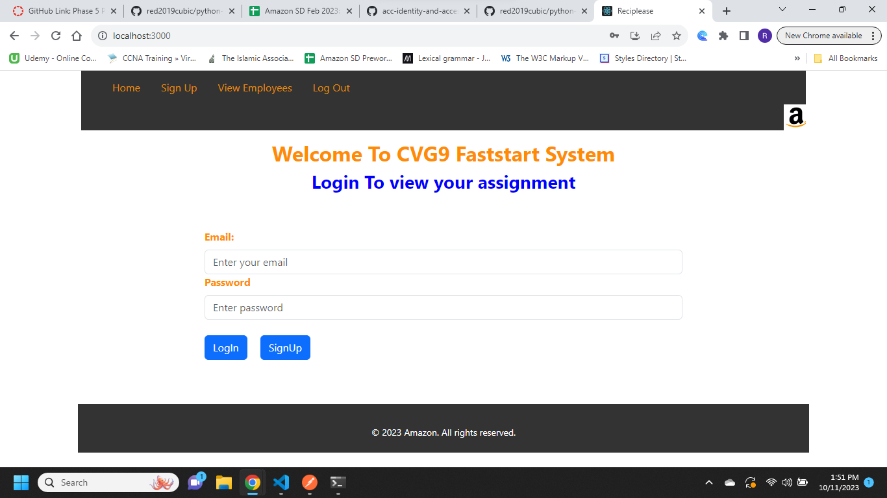
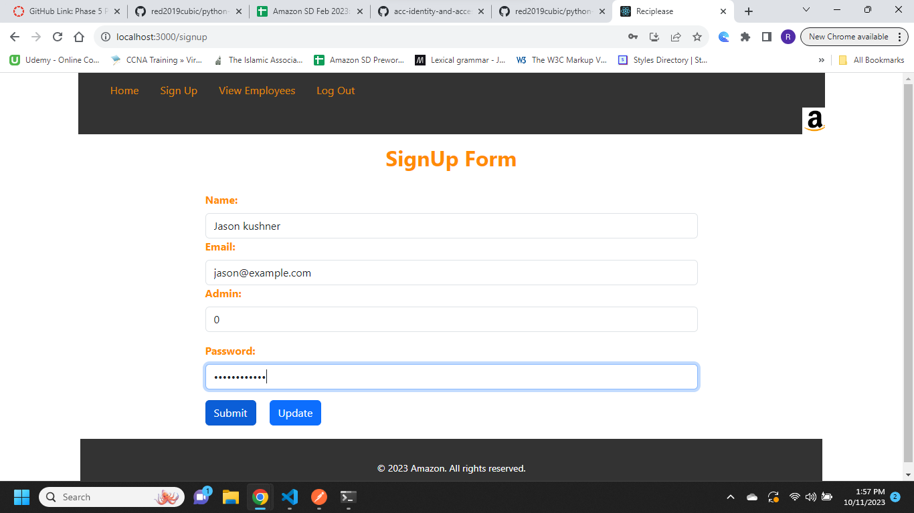
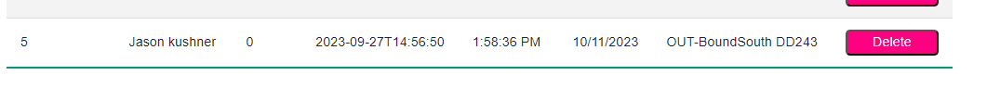
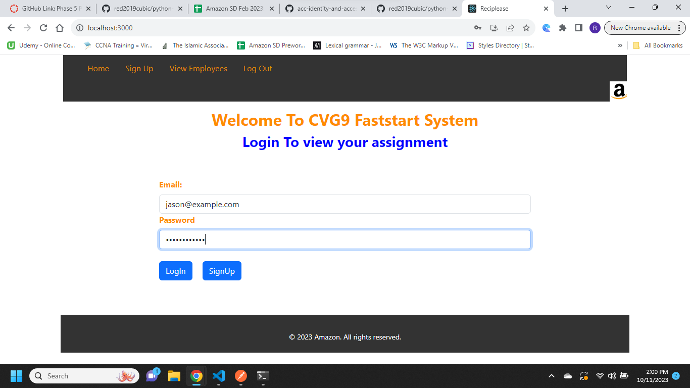
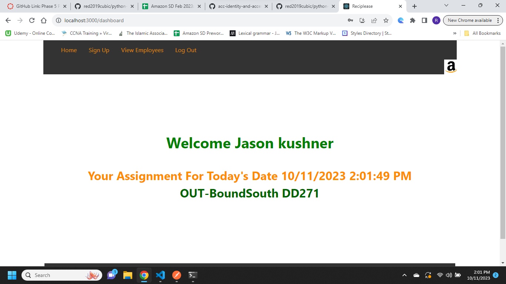

# Back-End 
## Models

    [x] - Employees
    [x] - Tasks
    [x] - Departments
    [x] - Employees_Tasks
    [x] - Employees_Departments
    [x] - seed.py 

## Constraint and validation(back-end)

    [x] add validation to column username in Employee table.
    [x] include unique constraint to validate the rest of the columns to prevent any duplicte.

## Routes

    [x]- employees (CRUD)
    [x]- login with session
    [x]- checksession

# Front-End

    [x]- Login 
    [x]- Signup 
    [x]- Header
    [x]- Footer
    [x]- Dashboard

## home screenshot:

## sign up page:

## view employees page:

## login page :

## dashboard page:

